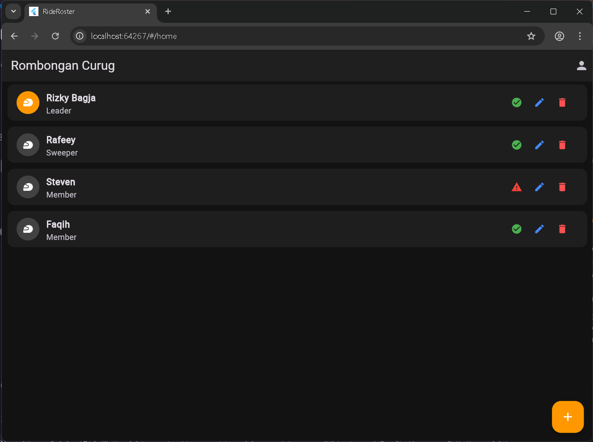

# 🏍️ RideRoster - Aplikasi Manajemen Rombongan Touring

## 📖 Deskripsi Aplikasi
**RideRoster** adalah aplikasi mobile berbasis purwarupa (prototype) yang dirancang untuk membantu koordinator perjalanan (*touring*) dalam mengelola daftar peserta rombongan. Aplikasi ini mempermudah pencatatan peran setiap peserta (seperti *Leader*, *Sweeper*, atau *Member*) serta memantau status kesiapan armada (motor) mereka sebelum perjalanan dimulai.

## 🎯 Tujuan Aplikasi
1. Memenuhi kriteria tugas Ujian Tengah Semester (UTS) mata kuliah Mobile Programming.
2. Menyediakan solusi digital yang praktis bagi komunitas atau himpunan mahasiswa untuk mengorganisir perjalanan kelompok agar lebih terstruktur, aman, dan mudah dipantau.

## ✨ Fitur Aplikasi
Aplikasi ini memiliki 3 halaman utama dengan alur navigasi (*routing*) yang dinamis:

* **1. Login Page**
  * Portal masuk khusus untuk Koordinator Perjalanan.
  * Dilengkapi form validasi: Email tidak boleh kosong dan harus berformat valid (`@`), serta Password minimal terdiri dari 6 karakter.
* **2. Home Page (Dashboard)**
  * Menampilkan daftar peserta rombongan menggunakan `ListView.builder`.
  * **Fitur CRUD Peserta:** Koordinator dapat menambah peserta baru, mengedit data/status kesiapan peserta yang sudah ada, serta menghapus peserta dari daftar melalui *pop-up dialog* yang interaktif.
* **3. Profile Page (CRUD Koordinator)**
  * Halaman manajemen kontak darurat koordinator.
  * **Fitur CRUD Profil:** Koordinator dapat memperbarui Nama, Email, dan Nomor HP yang disimulasikan penyimpanannya menggunakan variabel lokal (*state*).
  * **Logout:** Fitur untuk keluar dari sesi dan mengembalikan pengguna ke halaman Login dengan menghapus riwayat navigasi.

## 🛠️ Teknologi yang Digunakan
* **Framework:** [Flutter](https://flutter.dev/)
* **Bahasa Pemrograman:** [Dart](https://dart.dev/)
* **Arsitektur/Routing:** `Named Routes` & `Navigator Push/Pop`
* **Manajemen State:** Stateful Widget (Local State)

## 📱 Screenshot Aplikasi




### Menjalankan Aplikasi
Pilih salah satu metode di bawah ini sesuai dengan kebutuhan Anda:

*   **Melalui Terminal:**
    ```bash
    flutter run
    ```

*   **Melalui VS Code:**
    1.  Buka proyek di VS Code.
    2.  Tekan `F5` atau klik menu **Run > Start Debugging**.
    3.  Pilih perangkat emulator atau perangkat fisik yang terhubung.

*   **Menjalankan di Web:**
    Karena proyek Anda memiliki folder `web`, Anda juga bisa menjalankannya di browser:
    ```bash
    flutter run -d chrome
    ```
